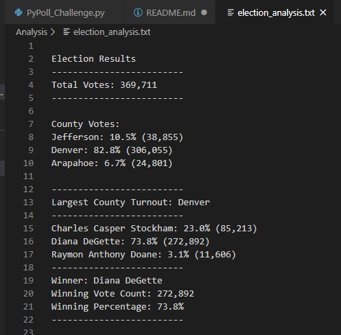

# Election_Analysis

#In this project, our final Python script will need to be able to deliver the below items. 
#They must be displayed/output in the specified format

1-Total number of votes cast
2-Total votes by county and the %
3-The county with the largest turnout 

4-A complete list of candidates who received votes
5-Total number of votes each candidate received
6-Percentage of votes each candidate won
7-The winner of the election based on popular vote

